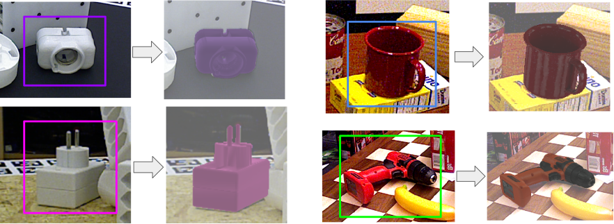

<h1 align="center">
CosyPose: Consistent multi-view multi-object 6D pose estimation
</h1>

<div align="center">
<h3>
<a href="http://ylabbe.github.io">Yann Labbé</a>,
<a href="https://jcarpent.github.io/">Justin Carpentier</a>,
<a href="http://imagine.enpc.fr/~aubrym/">Mathieu Aubry</a>,
<a href="http://www.di.ens.fr/~josef/">Josef Sivic</a>
<br>
<br>
ECCV: European Conference on Computer Vision, 2020
<br>
<br>
<a href="https://arxiv.org/abs/2008.08465">[Paper]</a>
<a href="https://www.di.ens.fr/willow/research/cosypose/">[Project page]</a>
<a href="https://youtu.be/4QYyEvnrC_o">[Video (1 min)]</a>
<a href="https://youtu.be/MNH_Ez7bcP0">[Video (10 min)]</a>
<a href="https://docs.google.com/presentation/d/1APHpaKKnkIvmquNJUVqERiMN4gEQ10Jt4IY7wTfIVgE/edit?usp=sharing">[Slides]</a>
<br>
<br>
Winner of the <a href="https://bop.felk.cvut.cz/challenges/bop-challenge-2020/">BOP Challenge 2020 </a> at ECCV'20 <a href="https://docs.google.com/presentation/d/1jZDu4mw-uNcwzr5jMFlqEddZsb7SjQozXVG3dT6-1M0/edit?usp=sharing">[slides]</a>  <a href="https://arxiv.org/abs/2009.07378"> [BOP challenge paper] </a>
</h3>
</div>

# Citation

If you use this code in your research, please cite the paper:

```bibtex
@inproceedings{labbe2020,
title= {CosyPose: Consistent multi-view multi-object 6D pose estimation}
author={Y. {Labbe} and J. {Carpentier} and M. {Aubry} and J. {Sivic}},
booktitle={Proceedings of the European Conference on Computer Vision (ECCV)},
year={2020}}
```

# News

- CosyPose is the winning method in the [BOP challenge 2020](https://bop.felk.cvut.cz/challenges/) (5 awards in total, including best overall method and best RGB-only method) ! All the code and models used for the challenge are available in this repository.
- We participate in the [BOP challenge 2020](https://bop.felk.cvut.cz/challenges/bop-challenge-2020/).
Results are available on the public [leaderboard](https://bop.felk.cvut.cz/leaderboards/) for 7 pose estimation benchmarks.
We release 2D detection models (MaskRCNN) and 6D pose estimation models (coarse+refiner) used on each dataset.
- The paper is available on arXiv and full code is released.
- Our paper on CosyPose is accepted at ECCV 2020.

This repository contains the code for the full CosyPose approach, including:

# Overview

## Single-view single-object 6D pose estimator


  
  Given an RGB image and a 2D bounding box of an object with known 3D model, the 6D pose estimator predicts the full 6D pose of the object with respect to the camera. Our method is inspired by DeepIM with several simplifications and technical improvements. It is fully implemented in pytorch and achieve single-view state-of-the-art on YCB-Video and T-LESS. We provide pre-trained models used in our experiments on both datasets. We make the training code that we used to train them available. It can be parallelized on multiple GPUs and multiple nodes.

## Synthetic data generation


The single-view 6D pose estimation models are trained on a mix of synthetic and real images. We provide the code for generating the additional synthetic images.

## Multi-view multi-object scene reconstruction


Single-view object-level reconstruction of a scene often fails because of detection mistakes, pose estimation errors and occlusions; which makes it impractical for real applications. Our multi-view approach, CosyPose, addresses these single-view limitations and helps improving 6D pose accuracy by leveraging information from multiple cameras with unknown positions. We provide the full code, including robust object-level multi-view matching and global scene refinement. The method is agnostic to the 6D pose estimator used, and can therefore be combined with many other existing single-view object pose estimation method to solve problems on other datasets, or in real scenarios. We provide a utility for running CosyPose given a set of input 6D object candidates in each image.

## BOP challenge 2020: single-view 2D detection + 6D pose estimation models


We used our {coarse+refinement} single-view 6D pose estimation method in the [BOP challenge 2020](https://bop.felk.cvut.cz/challenges/bop-challenge-2020/). In addition, we trained a MaskRCNN detector (torchvision's implementation) on each of the 7 core datasets (LM-O, T-LESS, TUD-L, IC-BIN, ITODD, HB, YCB-V). We provide 2D detectors and 6D pose estimation models for these datasets. All training (including 2D detector), inference and evaluation code are available in this repository. It can be easily used for another dataset in the BOP format.