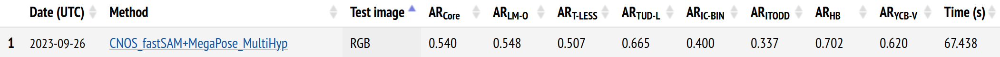
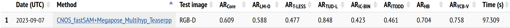

# Evaluating Megapose

Please make sure you followed the steps relative to the evaluation in the main readme.

## Evaluating with Megapose detector
Run a detector part of Megapose pipeline to detect bounding boxes in the image dataset at run-time.

```
python -m happypose.pose_estimators.megapose.scripts.run_full_megapose_eval detector_run_id=bop_pbr coarse_run_id=coarse-rgb-906902141 refiner_run_id=refiner-rgb-653307694 ds_names=[ycbv.bop19,lmo.bop19,tless.bop19,tudl.bop19,icbin.bop19,hb.bop19,itodd.bop19,hope.bop19] result_id=detector_1posehyp detection_coarse_types=[["detector","SO3_grid"]] inference.n_pose_hypotheses=1 skip_inference=false run_bop_eval=true
```

## Evaluating with external detections

First step: download external detections from bop website (such as default detections for task 1 and 4). You should have one csv file for every bop dataset.
Place these in a directory of your choice and define the environment variable.

```sh
EXTERNAL_DETECTIONS_DIR = /path/to/saved/detections/
```

Megapose expects a json file named `bop_detections_filenames.json` placed in `EXTERNAL_DETECTIONS_DIR` mapping bop dataset names to the csv file names, e.g. for CNOS detection (default detection for task 4, bop23):

```json
{
    "ycbv": "cnos-fastsam_ycbv-test_f4f2127c-6f59-447c-95b3-28e1e591f1a1.json",
    "lmo": "cnos-fastsam_lmo-test_3cb298ea-e2eb-4713-ae9e-5a7134c5da0f.json",
    "tless": "cnos-fastsam_tless-test_8ca61cb0-4472-4f11-bce7-1362a12d396f.json",
    "tudl": "cnos-fastsam_tudl-test_c48a2a95-1b41-4a51-9920-a667cb3d7149.json",
    "icbin": "cnos-fastsam_icbin-test_f21a9faf-7ef2-4325-885f-f4b6460f4432.json",
    "itodd": "cnos-fastsam_itodd-test_df32d45b-301c-4fc9-8769-797904dd9325.json",
    "hb": "cnos-fastsam_hb-test_db836947-020a-45bd-8ec5-c95560b68011.json"
}
```

To reproduce the results we obtained for the BOP-Challenge, please run the following commands :

```sh
# RGB 1 hyp
python -m happypose.pose_estimators.megapose.scripts.run_full_megapose_eval coarse_run_id=coarse-rgb-906902141 refiner_run_id=refiner-rgb-653307694 ds_names=[ycbv.bop19,lmo.bop19,tless.bop19,tudl.bop19,icbin.bop19,hb.bop19,itodd.bop19] result_id=exte_det_1posehyp detection_coarse_types=[["exte","SO3_grid"]] inference.n_pose_hypotheses=1 skip_inference=False run_bop_eval=true
```

Results :


```sh
# RGB 5 hyp
python -m happypose.pose_estimators.megapose.scripts.run_full_megapose_eval coarse_run_id=coarse-rgb-906902141 refiner_run_id=refiner-rgb-653307694 ds_names=[ycbv.bop19,lmo.bop19,tless.bop19,tudl.bop19,icbin.bop19,hb.bop19,itodd.bop19] result_id=exte_det_5posehyp detection_coarse_types=[["exte","SO3_grid"]] inference.n_pose_hypotheses=5 skip_inference=False run_bop_eval=true
```

Results :



```sh
# RGB-D 5 hyp
python -m torch.distributed.run  --nproc_per_node gpu -m happypose.pose_estimators.megapose.scripts.run_full_megapose_eval coarse_run_id=coarse-rgb-906902141 refiner_run_id=refiner-rgb-653307694 ds_names=[tless.bop19,tudl.bop19,icbin.bop19,hb.bop19,itodd.bop19] result_id=exte_det_5posehyp_teaserpp detection_coarse_types=[["exte","SO3_grid"]] inference.n_pose_hypotheses=5 inference.run_depth_refiner=true inference.depth_refiner=teaserpp skip_inference=False run_bop_eval=True
```

Results :



# Example on Jean Zay supercalculator

In particular, for this challenge, we used Jean Zay, a french supercalculator. Here is a quick documentation, for additional information on who can use this calculator, please refer to the [official documentation](http://www.idris.fr/eng/jean-zay/index.html).

You need to create an account to log on Jean Zay : https://www.edari.fr/

To connect by ssh to Jean Zay using this account, you need to register the IP address of the machine you use to connect to Jean Zay. If you work in a french research laboratory, your laboratory probably have a bouncing machine that is registered.

Once you are connected to Jean Zay, you will have access to different storage space: `$HOME`, `$WORK`, `$SCRATCH`, `$STORE`. More details on [Jean Zay website](http://www.idris.fr/eng/jean-zay/cpu/jean-zay-cpu-calculateurs-disques-eng.html)

You should store your code in `$WORK` and the data on `$SCRATCH`. Be careful, everything not used during 30 days on `$SCRATCH` is deleted.

Before following the regular installation procedure of `HappyPose`, make sur to load this module : `module load anaconda-py3/2023.03`

Then, you can follow the procedure in your current shell.

Once it is done, to run a job you need to use `slurm`. More detail on [Jean Zay website](http://www.idris.fr/eng/jean-zay/gpu/jean-zay-gpu-exec_partition_slurm-eng.html).

Here are some examples of slurm scripts used during the project. To run a `slurm` script, use the following command : `sbatch script.slurm`. You can use the command `sacct` to see the state of your script. You can visualize the content of the logs using the command `tail -f`. For example to see the error logs, use `tail -f logs/inference-happypose.err`.

```bash
# inference.slurm
#!/bin/bash
#SBATCH --job-name=happypose-inference
#SBATCH --output=logs/inference-happypose.out
#SBATCH --error=logs/inference-happypose.err
#SBATCH --nodes=1                    # on demande un noeud
#SBATCH --ntasks-per-node=1          # avec une tache par noeud (= nombre de GPU ici)
#SBATCH --gres=gpu:1
#SBATCH --cpus-per-task=10
#SBATCH --hint=nomultithread
#SBATCH --account zbb@v100
#SBATCH --time=00:10:00

## load Pytorch module
module purge
module load module load anaconda-py3/2023.03
conda activate happypose

cd happypose
# Assuming you have downloaded the example and models
python -m happypose.pose_estimators.cosypose.cosypose.scripts.run_inference_on_example barbecue-sauce --run-inference
# python -m happypose.pose_estimators.megapose.scripts.run_inference_on_example barbecue-sauce --run-inference
```


```bash
# evaluation.slurm
#!/bin/bash
#SBATCH --job-name=happypose-evaluation-1H
#SBATCH --output=logs/evaluation-happypose-1h.out
#SBATCH --error=logs/evaluation-happypose-1h.err
#SBATCH -C v100-32g
#SBATCH --nodes=1                    # on demande un noeud
#SBATCH --ntasks-per-node=4          # avec une tache par noeud (= nombre de GPU ici)
#SBATCH --gres=gpu:4
#SBATCH --cpus-per-task=10
#SBATCH --hint=nomultithread
#SBATCH --account zbb@v100
#SBATCH --time=04:00:00

## load Pytorch module
module purge
module load anaconda-py3/2023.03
conda activate happypose_pytorch3d

cd happypose

python -m torch.distributed.run  --nproc_per_node gpu -m happypose.pose_estimators.megapose.scripts.run_full_megapose_eval coarse_run_id=coarse-rgb-906902141 refiner_run_id=refiner-rgb-653307694 ds_names=[lmo.bop19] result_id=exte_det_1posehyp detection_coarse_types=[["exte","SO3_grid"]] inference.n_pose_hypotheses=1 skip_inference=False run_bop_eval=true
```
